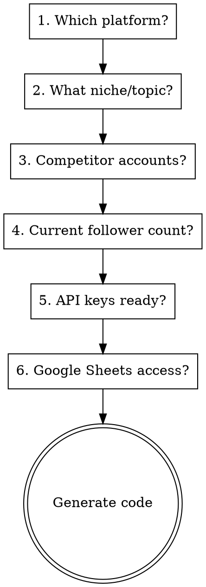

# Social Growth Automation

## Overview

Interactive skill that builds automated engage-then-follow bots for Twitter/X and Instagram. Scrapes competitor followers, warms them with likes, follows them, and unfollows non-followers — tracked in Google Sheets.

## When to Use

- User wants to grow Twitter/X or Instagram followers automatically
- User asks about follow/unfollow strategies
- User wants to automate social media engagement
- User mentions competitor follower scraping

## Supported Platforms

| Platform | Method | Cost |
|----------|--------|------|
| **Twitter/X** | Twitter API v2 (OAuth 1.0a) | ~$100/mo API + hosting |
| **Instagram** | PhantomBuster automation chain | ~$70-130/mo PhantomBuster |

## Interactive Setup Flow

When invoked, walk the user through these questions ONE AT A TIME:



### Question Details

**Q1: Platform** — Twitter/X or Instagram? (determines which template to use)

**Q2: Niche** — What do you tweet/post about? (used for prospect filter suggestions)

**Q3: Competitors** — 2-5 accounts in their niche with 5K-100K followers. Ask how many recent followers to scrape per competitor (default: 2000).

**Q4: Follower count** — Determines ramp-up aggressiveness:
- Under 500: Conservative start (20 follows/day week 1)
- 500-2000: Moderate (30 follows/day week 1)
- 2000-5000: Aggressive (40 follows/day week 1)
- 5000+: Full speed (50 follows/day week 1)

**Q5: API keys** — Walk through setup if they don't have them yet (see platform-specific guides below)

**Q6: Google Sheets** — Walk through Google Cloud service account setup if needed

## Twitter/X Setup Guide

### API Setup Walkthrough

If user doesn't have API keys:
1. Go to developer.x.com, sign in
2. Create a Project and App
3. Set App permissions to **"Read and Write"** (critical — Read-only won't work for likes/follows)
4. Generate Consumer Keys (API Key + Secret) — these are OAuth 1.0a keys
5. Generate Access Token + Secret
6. Get Bearer Token

**Common mistake:** User gives OAuth 2.0 Client ID instead of OAuth 1.0a Consumer Key. The Consumer Key is ~25 chars alphanumeric. The Client ID contains colons and is base64-encoded. Ask for the one labeled "API Key" or "Consumer Key".

**After changing permissions:** User MUST regenerate Access Token and Secret. Old tokens keep the old permission scope.

### Generated Files

Generate these files in a `twitter_bot/` directory, customized with user's answers:

| File | Purpose |
|------|---------|
| `config.py` | API credentials, competitor list, limits, delays, OAuth 1.0a signing, api_get/api_post/api_delete helpers |
| `sheets.py` | Google Sheets read/write/update via gspread |
| `scraper.py` | Fetch N most recent followers from each competitor, filter by follower count/tweet count, write to Prospects sheet |
| `warmer.py` | Like 2-3 recent tweets per prospect to get in their notifications |
| `follower.py` | Follow warmed prospects, track in Followed sheet |
| `unfollower.py` | Unfollow non-followers after 72h |
| `runner.py` | Schedule library orchestrator — runs morning (scrape+warm), evening (follow), every 3 days (unfollow) |
| `requirements.txt` | requests, gspread, google-auth, schedule, python-dotenv |
| `.env` | API credentials (user fills in) |

See `templates/twitter/` for complete code templates.

### Key Implementation Details

**OAuth 1.0a signing:** All endpoints use OAuth 1.0a (not Bearer token). Bearer fails on user-context endpoints like `users/me`, `users/:id/followers`. Build HMAC-SHA1 signature manually.

**api_get uses OAuth too:** Initially you might use Bearer for GET requests, but `users/me` and follower endpoints require OAuth 1.0a. Use OAuth for ALL requests.

**Rate limit handling:** Check for 429 status, read `x-rate-limit-reset` header, sleep until reset. Retry once.

**Delays:** Always randomized (e.g., `random.randint(60, 90)`) to look human. Never fixed intervals.

**Google Sheets scopes:** Must include BOTH `spreadsheets` and `drive` scopes. The `drive` scope is needed for `gspread.open()` to find sheets by name.

**Virtual environment:** Use `python3 -m venv venv` inside the bot directory. macOS blocks system-wide pip installs.

### Google Sheets Structure

4 tabs:
- **Competitors** — handle
- **Prospects** — handle, user_id, followers_count, tweet_count, source, date_found, status (new/warmed/followed/skipped)
- **Followed** — handle, user_id, date_followed, followed_back (pending/yes/no)
- **Weekly Tracking** — week, followers_start, followers_end, followed, unfollowed, followback_rate

### Daily Schedule

```
9:00 AM  — scraper.py (fetch competitor followers) + warmer.py (like their tweets)
6:00 PM  — follower.py (follow warmed prospects)
Every 3 days:
10:00 AM — unfollower.py (unfollow non-followers after 72h)
Sunday   — rest day (no automation)
```

### Ramp-Up Defaults (by follower count)

| Followers | Week 1 | Week 2 | Week 3 | Week 4+ |
|-----------|--------|--------|--------|---------|
| <500 | 20 follows, 60 likes | 35 follows, 100 likes | 50 follows, 150 likes | 50 follows, 150 likes |
| 500-2K | 30 follows, 80 likes | 40 follows, 120 likes | 50 follows, 150 likes | 50 follows, 150 likes |
| 2K-5K | 40 follows, 100 likes | 50 follows, 150 likes | 50 follows, 150 likes | 50 follows, 150 likes |
| 5K+ | 50 follows, 150 likes | 50 follows, 150 likes | 50 follows, 150 likes | 50 follows, 150 likes |

### Testing Flow

After generating code, walk user through:
1. Fill `.env` with API keys
2. Set up Google Cloud service account + share sheet
3. Run `scraper.py` — verify prospects appear in sheet
4. Run `warmer.py` — verify likes sent, status updated to "warmed"
5. Run `follower.py` — verify follows sent, Followed tab populated
6. Start `runner.py` — verify scheduler works

Test each step before moving to the next. If a step fails (common: 403 on likes = wrong permissions, 401 = wrong keys, 402 = out of credits), debug before continuing.

## Instagram Setup Guide

### PhantomBuster Chain

5 Phantoms chained together:

| Phantom | Purpose | Schedule |
|---------|---------|----------|
| 1. Post Collector | Scrape competitor posts | Daily 9:00 AM |
| 2. Likers Collector | Scrape likers from posts | Chained after P1 |
| 3. Auto Liker | Like 2 posts per prospect | Chained after P2 |
| 4. Auto Follow | Follow warmed prospects | Separate: 6:00 PM |
| 5. Auto Unfollow | Unfollow non-followers | Every 3 days: 10:00 AM |

**Critical:** Do NOT chain P4 after P3. Schedule P4 separately at 6:00 PM to create a natural gap between liking and following.

### Setup Requirements

- PhantomBuster account ($70-130/mo)
- Instagram session cookie (refresh every 5 days)
- Google Sheet with Competitors tab (profile URLs)

### Safety Limits

- Max 40 follows/day
- Max 150 likes/day
- 90+ second delays between actions
- Following/follower ratio under 1.5x
- Hard cap: 7,500 total following
- Full rest day every week

## Common Mistakes

| Issue | Cause | Fix |
|-------|-------|-----|
| 403 on likes/follows | App permissions set to "Read" only | Change to "Read and Write", regenerate Access Token |
| 401 Unauthorized | Wrong key type (OAuth 2.0 Client ID vs OAuth 1.0a Consumer Key) | Use the API Key from "Consumer Keys" section (~25 chars) |
| 402 Payment Required | Out of API credits | Buy more credits on developer portal |
| Google Sheets 403 | Missing drive scope | Add `https://www.googleapis.com/auth/drive` to scopes |
| `pip install` fails on macOS | Externally managed environment | Use `python3 -m venv venv` first |
| Bearer token fails on users/me | Bearer can't access user-context endpoints | Use OAuth 1.0a for ALL requests |

## Safety Disclaimer

Automated following/unfollowing may violate platform Terms of Service. Risks include restrictions, reduced visibility, and account suspension. Always combine automation with genuine content.
